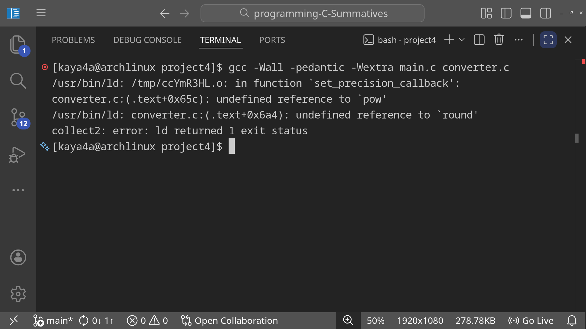

# Unit Conversion Toolkit

A console unit converter written in C. It convert between common units using function pointers, keep a dynamic history array, and save/load that history in a binary file (`conversions.bin`) so data stay between runs. You can search, sort with `qsort` callbacks, filter records, and round results to a chosen precision from a menu.

## Features

1. `Perform a conversion`: pick a type (temp, distance, mass, length) and convert a value via function pointers
2. `View conversion history`: show all stored conversions from the dynamic array
3. `Search records`: look up by conversion type or exact converted value
4. `Sort records`: sort by type or result using `qsort` callbacks
5. `Callback operations`: set decimal precision for all results, or filter by type / value range
6. `Save history` and `Load history`: write and read count + records as binary (`conversions.bin`)
7. Auto load on start and save on exit (same idea as project 3 for data persistency)

## How to build and run

```bash
gcc -Wall -pedantic -Wextra -Werror main.c converter.c -o converter -lm
./converter
```

Then pick options `1`–`8` from the menu. Option `8` exits after saving history into `conversions.bin`.

## Files

- `converter.h` — ConvType enum, Record struct, extern globals, and function prototypes
- `converter.c` — conversions, history, file I/O, callbacks, search, sort, and menu
- `main.c` — load history then start the menu

## Conversions available

| Index | Conversion |
|------:|------------|
| 0 | Celsius -> Fahrenheit |
| 1 | Fahrenheit -> Celsius |
| 2 | Kilometres -> Miles |
| 3 | Miles -> Kilometres |
| 4 | Kilograms -> Pounds |
| 5 | Pounds -> Kilograms |
| 6 | Centimetres -> Inches |
| 7 | Inches -> Centimetres |

**Note**: On compiling the files we have to add `-lm` flag to tell the linker to connect our program with C standard math library (`libm`).



This avoid referencing errors like one above where some library builtin functions can't be referenced since linker doesn't undertsand where to look for. `-lm` is actually `-l` which stand for `link library` and `m` which is short for math library, and together they instruct linker to look for math library.

---
<div align="center">
<p> Build with ❤️</p>
</div>
